# Image Classification with Convolutional Neural Networks

This project explores various convolutional neural network (CNN) architectures and techniques for image classification using the CINIC-10 dataset. The experiments include hyperparameter tuning, architecture modifications, transfer learning, few-shot learning, and ensemble learning.

## Table of Contents
1. [Introduction](#introduction)
2. [Dataset Description](#dataset-description)
3. [Methodology](#methodology)
4. [Experiments](#experiments)
   - [ResNet18](#resnet18)
   - [VGG\_OUR](#vgg_our)
   - [Transfer Learning](#transfer-learning)
   - [Few-Shot Learning](#few-shot-learning)
   - [Ensemble Learning](#ensemble-learning)
5. [Results](#results)
6. [How to Reproduce](#how-to-reproduce)
7. [Directory Structure](#directory-structure)
8. [References](#references)

---

## Introduction

Image classification is a fundamental problem in computer vision, with applications ranging from medical diagnostics to autonomous vehicles. The advent of deep learning, particularly CNNs, has greatly improved the performance of image classification systems. This project investigates and compares different neural network architectures and techniques to improve image classification performance on the CINIC-10 dataset.

---

## Dataset Description

The CINIC-10 dataset (\textit{CINIC-10 Is Not ImageNet or CIFAR-10}) serves as an intermediary benchmark between CIFAR-10 and ImageNet. It contains:
- **270,000 images** evenly distributed across 10 classes: airplane, automobile, bird, cat, deer, dog, frog, horse, ship, and truck.
- **Image size**: 32x32 pixels.
- **Subsets**: Training, validation, and test sets, each with 90,000 images.
- **Source**: Combines CIFAR-10 and downsampled ImageNet images, introducing a degree of distributional shift that poses additional challenges for classification models.

---

## Methodology

The project involves:
1. **Preliminary Analysis**:
   - Dataset exploration.
   - Defining metrics (accuracy, F1-score, precision, recall, confusion matrix).

2. **Model Architectures**:
   - Implementing classical CNNs (e.g., ResNet, VGG, EfficientNet).
   - Modifying architectures for efficiency.

3. **Hyperparameter Tuning**:
   - Learning rate, momentum, weight decay, batch size, etc.

4. **Data Augmentation**:
   - Standard techniques (e.g., horizontal flip, rotation).
   - Advanced techniques (e.g., AutoAugment, CutMix).

5. **Few-Shot Learning**:
   - Prototypical networks.
   - Transfer learning and meta-learning.

6. **Ensemble Learning**:
   - Hard voting, soft voting, stacking.

---

## Experiments

### ResNet18
- **Objective**: Investigate the impact of learning rate, momentum, weight decay, and augmentations.
- **Findings**:
  - Learning rate significantly affects convergence.
  - Momentum and weight decay influence generalization.
  - Single augmentations improve test accuracy, but excessive augmentations may degrade performance.
- **Key Observations**:
  - High learning rates caused unstable training, while low learning rates led to overfitting.
  - Momentum values below 0.5 resulted in slower convergence.
  - Excessive weight decay hindered learning.

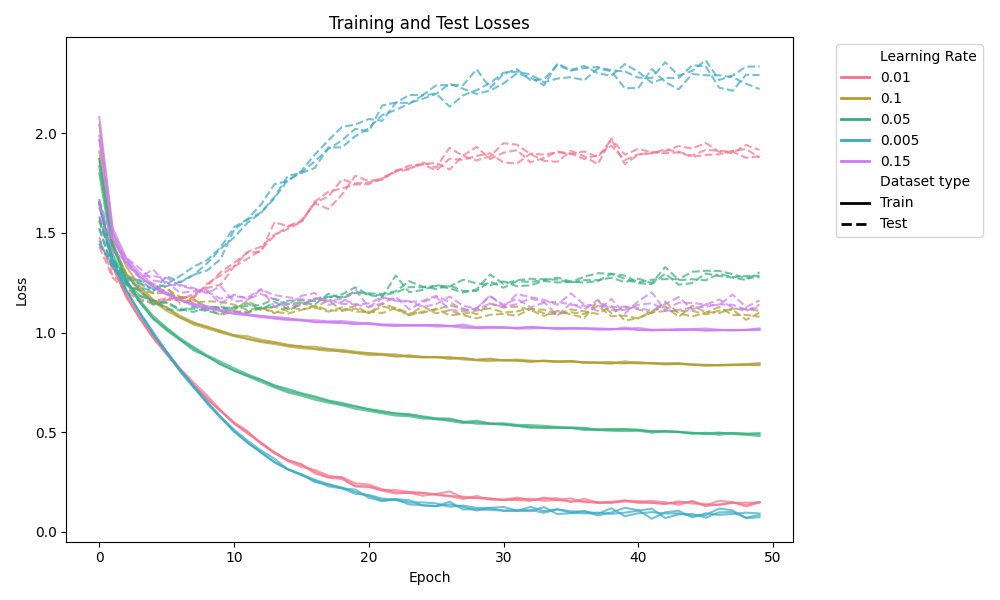  
*Figure 1: Impact of different learning rates on ResNet18 training.*

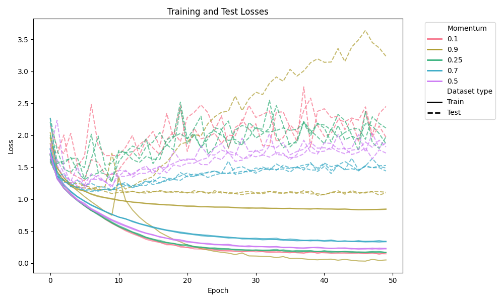  
*Figure 2: Effect of momentum values on ResNet18 convergence.*

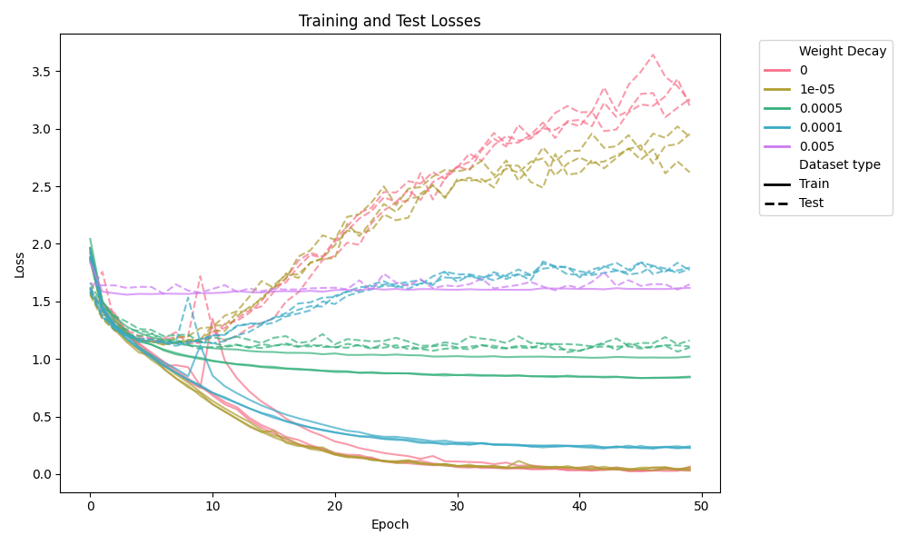  
*Figure 3: Influence of weight decay on ResNet18 generalization.*

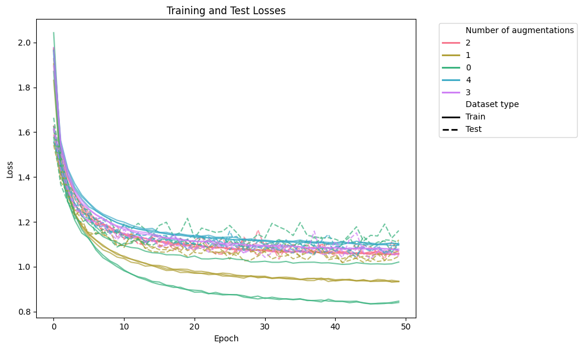  
*Figure 4: Performance of ResNet18 with various data augmentation techniques.*

---

### VGG\_OUR
- **Objective**: Modify VGG16 for CINIC-10.
- **Key Changes**:
  - Reduced fully connected layers from 4096 neurons to 512 neurons to prevent overfitting.
  - Adjusted pooling strategy to retain more spatial information by limiting pooling to three layers.
  - Added dropout (rate = 0.3) for regularization.
- **Results**: Achieved ~80% accuracy with reduced overfitting.
- **Challenges**:
  - Rapid overfitting observed after a dozen epochs.
  - Data augmentation delayed overfitting but did not eliminate it entirely.

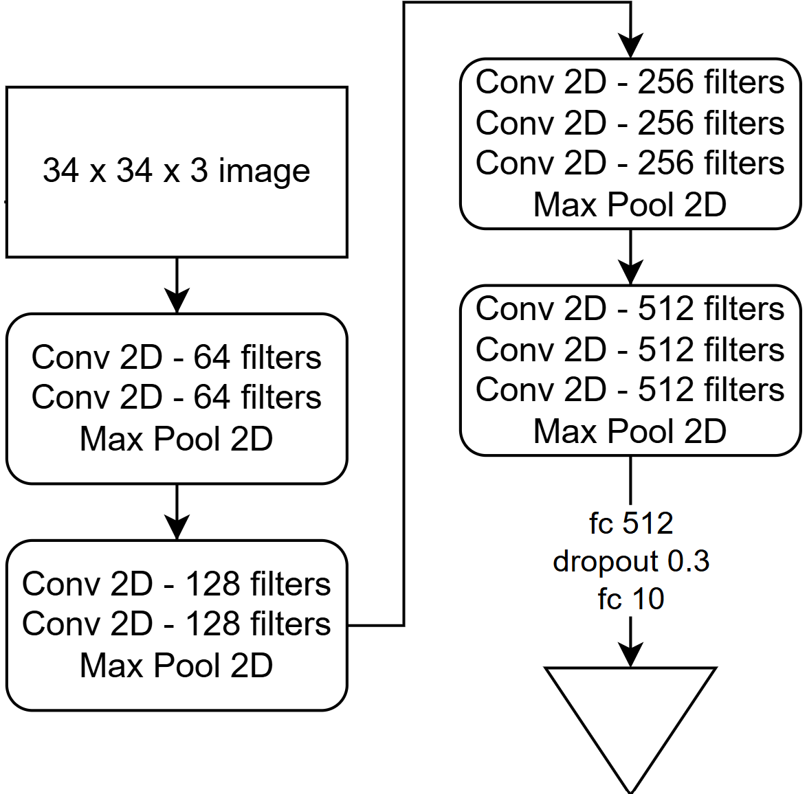  
*Figure 5: Modified VGG\_OUR architecture for CINIC-10.*

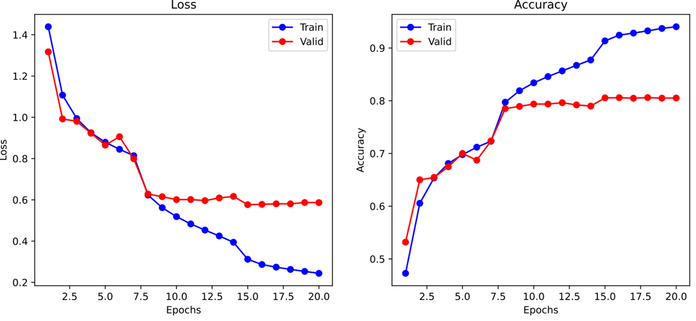  
*Figure 6: Best performance of VGG\_OUR during training.*

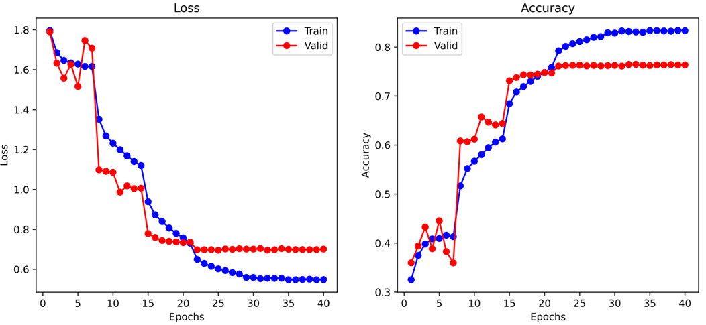  
*Figure 7: VGG\_OUR performance with AutoAugment applied.*

---

### Transfer Learning
- **Model**: EfficientNetB0.
- **Approach**: Fine-tune on CIFAR-10 subset of CINIC-10 to avoid overlap with ImageNet.
- **Modifications**:
  - Replaced the classification head with a dropout layer (p=0.2) and a linear layer for 10 classes.
  - Fine-tuned the entire network.
- **Results**: Achieved 96% accuracy with minimal modifications.
- **Key Insights**:
  - Pretraining on ImageNet enabled strong generalization.
  - Moderate weight decay (0.001) balanced regularization and performance.

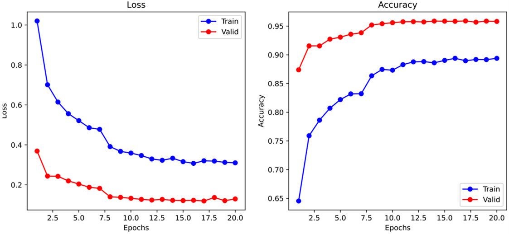  
*Figure 8: Best accuracy achieved by EfficientNetB0 during transfer learning.*

---

### Few-Shot Learning
- **Algorithm**: Prototypical Networks.
- **Training**:
  - Used Mini-ImageNet dataset for training to avoid overlap with CINIC-10.
  - Trained over 300 episodes with and without data augmentation.
- **Evaluation**:
  - Tested on CINIC-10 using randomly sampled support and query sets.
  - Larger support sets improved accuracy.
- **Findings**:
  - Models trained without augmentations performed better, likely due to limited computational resources.
  - Augmentations delayed convergence.

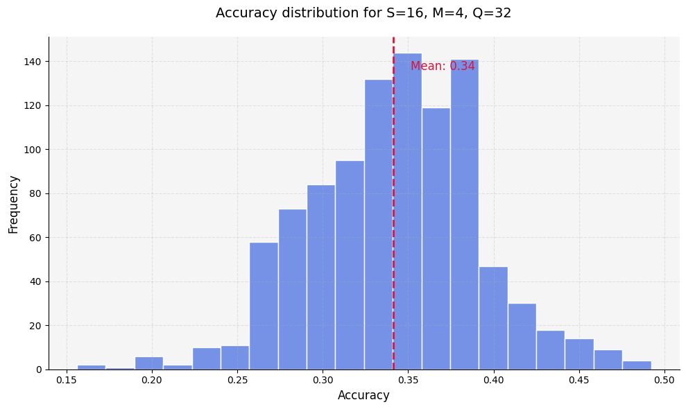  
*Figure 9: Few-shot learning performance with augmentations.*

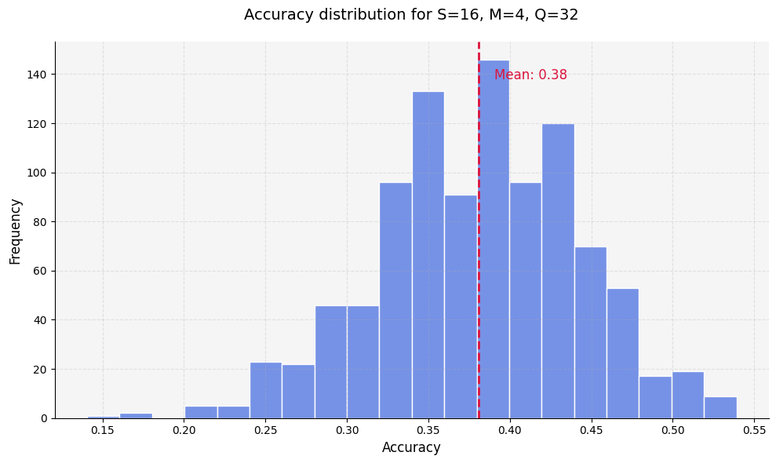  
*Figure 10: Few-shot learning performance without augmentations.*

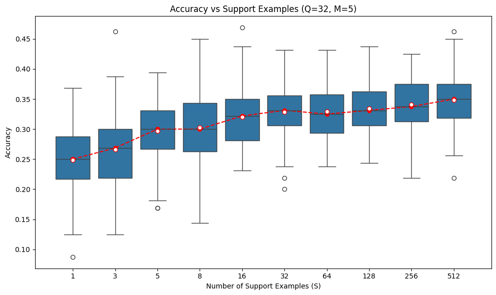  
*Figure 11: Impact of support set size on accuracy without augmentations.*

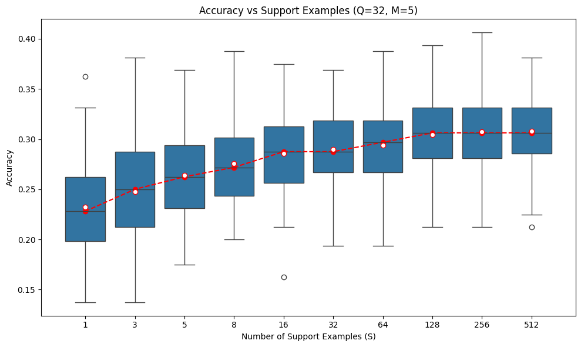  
*Figure 12: Impact of support set size on accuracy with augmentations.*

---

### Ensemble Learning
- **Methods**:
  - Hard Voting: Combined predictions from multiple models but did not improve accuracy.
  - Soft Voting: Averaged predicted probabilities, resulting in improved accuracy (80.29%).
- **Conclusion**: Aggregating models enhances performance, with soft voting being more effective than hard voting.

---

## Results

| Experiment                | Best Accuracy |
|---------------------------|---------------|
| ResNet18                  | ~77%          |
| VGG\_OUR                  | ~80%          |
| Transfer Learning (EffNet)| ~96%          |
| Few-Shot Learning         | ~75%          |
| Ensemble Learning         | ~80.29%       |

---

## How to Reproduce

1. **VGG\_OUR Experiments**:
   - Run `ex_vgg_our.ipynb` with appropriate parameters.
2. **Transfer Learning**:
   - Use `ex_cifar_transfer_efficient_net_b0.ipynb` with CIFAR-10 extracted from CINIC-10.
3. **Few-Shot Learning**:
   - Follow the steps in `few_shot_embedder.py` after downloading Mini-ImageNet.
4. **ResNet Training**:
   - Use `train_resnet18.py` with specified parameters.

---

## Directory Structure

```
/convolutional_neural_networks
├── data/                     # Dataset directory (CINIC-10, Mini-ImageNet)
├── experiments/              # Results and saved models
├── reports/                  # LaTeX report and images
├── ex_vgg_our.ipynb          # VGG\_OUR experiments
├── ex_cifar_transfer_efficient_net_b0.ipynb # Transfer learning experiments
├── few_shot_embedder.py      # Few-shot learning implementation
├── train_resnet18.py         # ResNet18 training script
└── README.md                 # Project documentation
```

---

## References

- CINIC-10 Dataset: \url{https://datashare.ed.ac.uk/handle/10283/3192}
- Simonyan, K., & Zisserman, A. (2014). Very Deep Convolutional Networks for Large-Scale Image Recognition.
- Tan, M., & Le, Q. (2020). EfficientNet: Rethinking Model Scaling for Convolutional Neural Networks.
- Snell, J., Swersky, K., & Zemel, R. (2017). Prototypical Networks for Few-shot Learning.