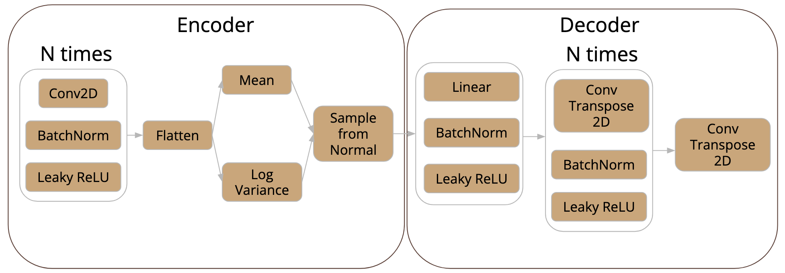
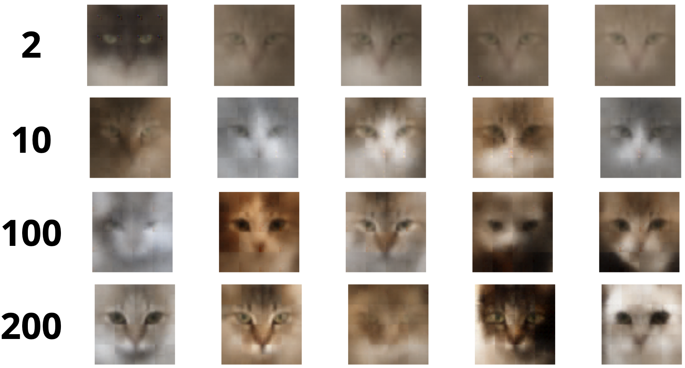
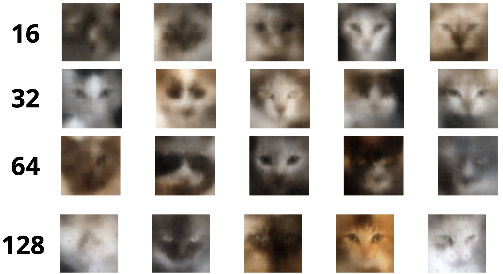
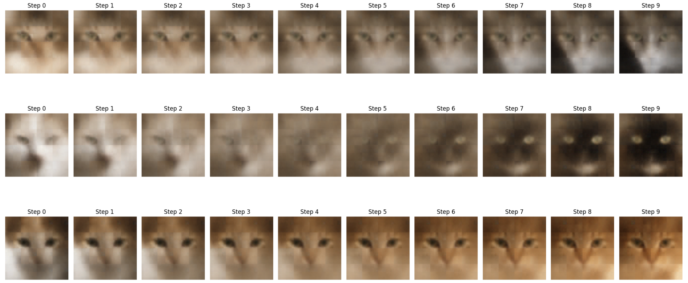
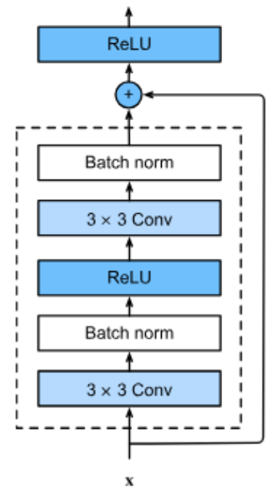
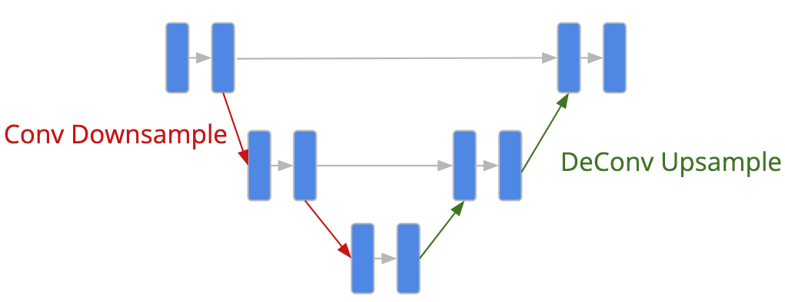
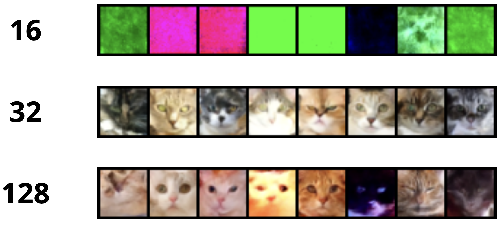
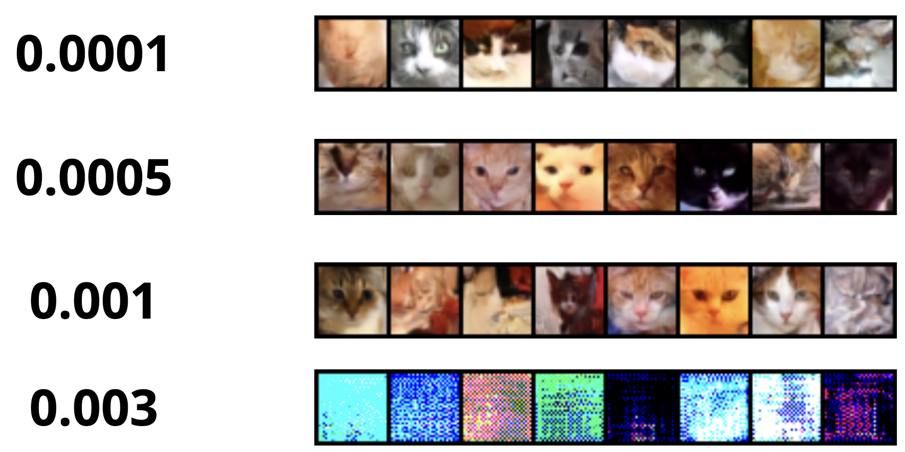
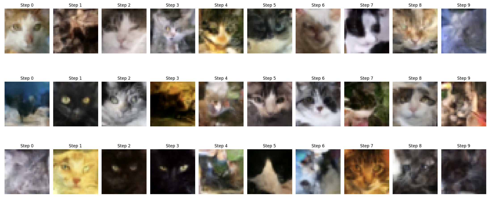

# Image Generation with Generative Models

This project explores and compares various generative models for image synthesis, focusing on datasets containing images of cats and dogs. The primary goal is to train models capable of generating realistic images, assess their quality, and investigate the characteristics of the latent space.

## Overview

The project evaluates three prominent generative modeling approaches:
1. **Variational Autoencoders (VAEs)**: Probabilistic models that encode images into a latent space and reconstruct them.
2. **Deep Convolutional GANs (DCGANs)**: Adversarial models that generate images through a generator-discriminator framework.
3. **Diffusion Models**: Emerging models that gradually corrupt and denoise data to generate high-quality images.

### Key Features
- **Dataset**: The project uses the Cats dataset and the Cats vs. Dogs dataset from Kaggle.
- **Evaluation Metrics**: Fréchet Inception Distance (FID) is used to assess the quality and diversity of generated images.
- **Hyperparameter Tuning**: Extensive experiments were conducted to analyze the impact of various hyperparameters on model performance.
- **Latent Space Exploration**: Interpolation experiments were performed to evaluate the structure and continuity of the learned latent space.

## Detailed Descriptions

### 1. Introduction
The project focuses on generating high-quality, diverse, and realistic images of cats using generative models. It explores different architectures, evaluates their performance using quantitative metrics like FID, and performs qualitative analyses through visual inspection. The study also investigates the effects of hyperparameter tuning on model performance.

### 2. Dataset Description
The Cats dataset contains 29,843 images of cats with a resolution of 64×64 pixels. The dataset exhibits diversity in lighting conditions, poses, and background complexity. Additionally, the Cats vs. Dogs dataset, containing 25,000 images, is used to evaluate the generalizability of the models.

### 3. Theoretical Background
- **Variational Autoencoders (VAEs)**: Introduces the concept of encoding images into a latent space and reconstructing them. The VAE loss function combines reconstruction loss and KL divergence, ensuring a structured latent space.
- **Deep Convolutional GANs (DCGANs)**: Describes the adversarial training process, where a generator creates images and a discriminator evaluates their realism. Highlights architectural innovations like batch normalization and strided convolutions.
- **Diffusion Models**: Explains the forward and reverse processes of gradually adding and removing noise to generate images. Emphasizes the use of a U-Net architecture with time-conditional layers.

### 4. Experimental Results
- **VAE Experiments**: Explored the impact of embedding dimensions and channel sizes on image quality. Demonstrated smooth latent space interpolation and achieved a best FID score of 164.06.
- **DCGAN Experiments**: Conducted hyperparameter tuning and evaluated performance on both the Cats dataset and the Cats vs. Dogs dataset. Highlighted challenges with multimodal datasets and mode collapse.
- **Diffusion Model Experiments**: Investigated the effects of channel size and learning rate. Achieved the best FID score of 101.21 but noted issues with latent space continuity.

### 5. Conclusions
The study highlights the strengths and weaknesses of each generative model:
- **VAEs**: Structured latent space and smooth interpolation.
- **DCGANs**: Sharp local features but struggles with multimodal datasets.
- **Diffusion Models**: Best quantitative performance and high-quality image generation.

### 6. Reproducibility Instructions
- **VAE**: Use the `variational_autoencoder_train.py` script with configurations from the `experiments_vae` directory. Generated images and metrics are saved automatically.
- **DCGAN**: Run the `dcgan.ipynb` notebook with the dataset path set in the `dataroot` parameter. Results are saved in the `main_dir/config_seed{i}` directory.
- **Diffusion Models**: Use the `unet_better_train.py` script with configurations from the `experiments_diffusion` directory. Generated images and metrics are saved automatically.

Additional tools:
- Use `interpolate.ipynb` to generate interpolation images for VAEs and Diffusion Models.
- Use `calculate_fid_faster.py` to compute FID scores for generated images.

## Visual Examples

### Dataset Samples
  
*Figure 1: Sample images from the Cats dataset. These images highlight the diversity in lighting, poses, and background complexity.*

### VAE Results
  
*Figure 2: Architecture of the Variational Autoencoder used in the experiments.*

  
*Figure 3: Generated samples using varying embedding dimensions for the VAE.*

  
*Figure 4: Generated images using different channel sizes for the VAE.*

  
*Figure 5: Latent space interpolation results for the VAE.*

### DCGAN Results
  
*Figure 6: DCGAN generator architecture.*

  
*Figure 7: Results of hyperparameter tuning for DCGAN. Dashed lines represent individual runs, and the solid line represents the mean FID value.*

  
*Figure 8: Examples of cat images generated by DCGAN in the configuration that gave the best FID score.*

  
*Figure 9: Latent space interpolation in DCGAN.*

  
*Figure 10: Results of hyperparameter tuning for DCGAN on the Cats vs. Dogs dataset.*

  
*Figure 11: Examples of cat and dog images generated by DCGAN in the configuration that gave the best FID score.*

### Diffusion Model Results
  
*Figure 12: Residual convolutional block used in the diffusion model.*

  
*Figure 13: Architecture of the diffusion model.*

  
*Figure 14: Generated images using different channel sizes in the diffusion model.*

  
*Figure 15: Generated images using different learning rates in the diffusion model.*

  
*Figure 16: Latent space interpolation results for the diffusion model.*

## Conclusion

This project demonstrates the strengths and weaknesses of VAEs, DCGANs, and Diffusion Models for image generation. While diffusion models achieved the best quantitative results, each approach offers unique advantages, such as VAEs' structured latent space and DCGANs' sharp local features.

For further exploration, consider extending the experiments to other datasets or implementing advanced generative architectures like StyleGAN or conditional diffusion models.