# Transformers

This repository is dedicated to the implementation, training, and evaluation of transformer-based architectures, which have revolutionized the field of deep learning. Transformers are particularly effective in tasks requiring the modeling of sequential data, such as natural language processing (NLP), computer vision, and time-series analysis. By leveraging self-attention mechanisms, transformers can capture long-range dependencies in data, making them a powerful tool for a wide range of applications.

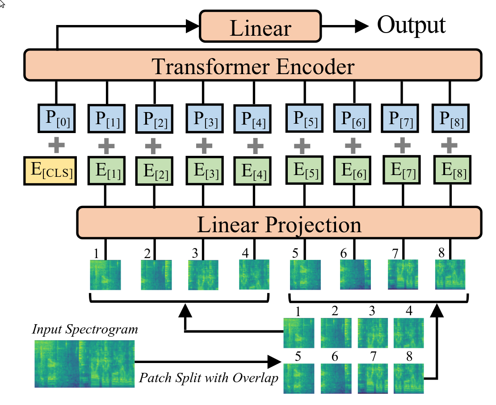
*Figure 1: Transformer architecture overview.*

## Project Overview

The primary objective of this project is to explore and compare different deep learning architectures for speech command classification. The task involves categorizing one-second audio clips into predefined commands such as `yes`, `no`, `up`, `down`, and others, while also handling `unknown` words and `silence`. The project evaluates both convolutional neural networks (CNNs) and transformer-based models, focusing on their performance, hyperparameter tuning, and ability to generalize.

## Features

This project provides the following key features:

- **Custom Architectures**:
  - VGG-like and ResNet-like 1D CNNs adapted for raw audio input.
  - Audio Spectrogram Transformer (AST) with both softmax and sigmoid heads.
- **Dataset Preprocessing**:
  - Handling of the Speech Commands Dataset, including class imbalance, `unknown` class merging, and `silence` generation from background noise.
  - Conversion of raw audio into spectrograms and Mel-spectrograms for transformer-based models.
- **Training and Evaluation**:
  - Scripts for training models with configurable hyperparameters.
  - Evaluation metrics including accuracy, precision, recall, F1 score, and confusion matrices.
- **Visualization Tools**:
  - Attention weight heatmaps, training loss curves, and class distribution plots.
- **Extensibility**:
  - Modular codebase designed for easy experimentation with new architectures and datasets.

## Dataset Description

The project uses the Speech Commands Dataset, which contains approximately 60,000 one-second audio clips of spoken words. The dataset includes 10 target commands (`yes`, `no`, `up`, `down`, `left`, `right`, `on`, `off`, `stop`, `go`), an `unknown` class for other words, and a `silence` class for background noise. Preprocessing steps include handling class imbalances and generating spectrograms for transformer-based models.

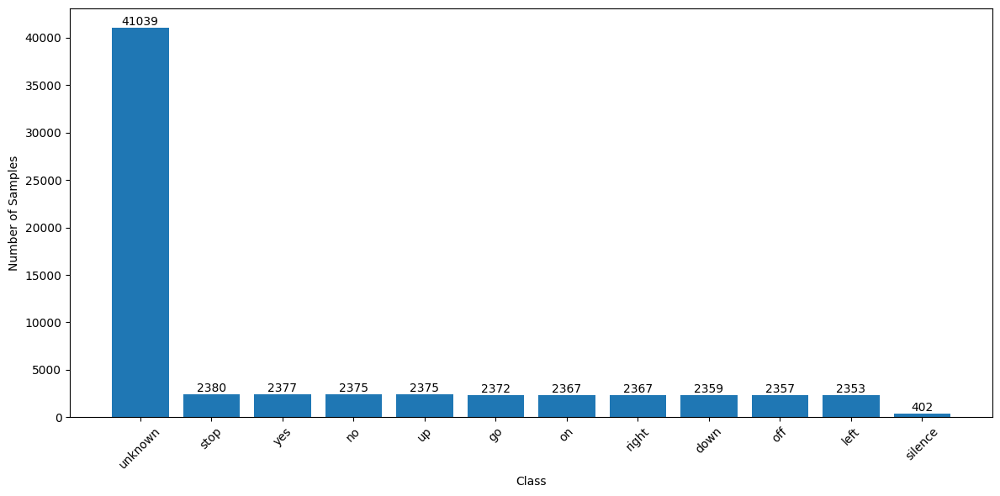
*Figure 2: Class distribution in the Speech Commands Dataset.*

## Architectures

### VGG-like 1D CNN

The VGG-like 1D CNN architecture is inspired by the VGG family of networks for image recognition. It uses convolutional layers with kernel size 9, batch normalization, ReLU activation, and max-pooling layers to progressively reduce temporal resolution. Fully connected layers with dropout regularization are used for classification.

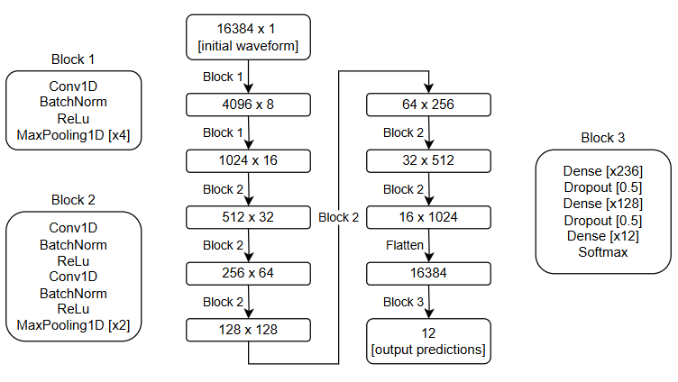
*Figure 3: VGG-like 1D CNN architecture.*

### ResNet-like 1D CNN

The ResNet-like 1D CNN introduces residual connections to mitigate the vanishing gradient problem. It uses bottleneck layers and shortcut connections to learn identity mappings, enabling the training of deeper networks.

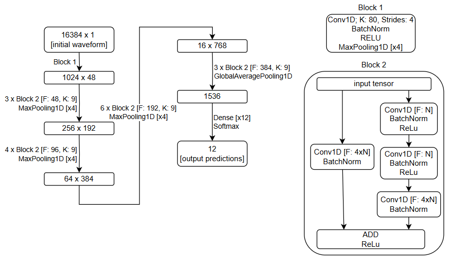
*Figure 4: ResNet-like 1D CNN architecture.*

### Audio Spectrogram Transformer (AST)

The AST processes audio spectrograms by dividing them into overlapping patches, which are flattened and passed through a transformer encoder. Positional encodings are added to retain temporal and spatial information. The model supports both softmax and sigmoid heads for classification.


*Figure 5: Audio Spectrogram Transformer architecture.*

## Installation

To set up the project, follow these steps:

1. **Clone the Repository**:
   Clone the repository to your local machine:
   ```bash
   git clone https://github.com/your-username/transformers.git
   cd transformers
   ```

2. **Install Dependencies**:
   Install the required Python packages using `pip`:
   ```bash
   pip install -r requirements.txt
   ```

3. **Preprocess the Dataset**:
   Use the `data_preprocessing.py` script to prepare the Speech Commands Dataset:
   ```bash
   python data_preprocessing.py --directory /path/to/dataset
   ```

## Usage

### Training a Model

To train a model, use the `train.py` script. Specify the configuration file containing hyperparameters and dataset paths:
```bash
python train.py --config configs/example_config.json
```
The configuration file should include details such as the learning rate, batch size, number of epochs, and model architecture.


*Figure 6: Training loss curve for a transformer model.*

### Evaluating a Model

To evaluate a pre-trained model, use the `evaluate.py` script. Provide the path to the model checkpoint and the test dataset:
```bash
python evaluate.py --model checkpoints/model.pth --data data/test_dataset
```
The script will output metrics such as accuracy, precision, recall, and F1 score.

### Visualizing Attention

To visualize the attention weights of a trained model, use the `visualize_attention.py` script:
```bash
python visualize_attention.py --model checkpoints/model.pth --input "Sample input text"
```
This will generate a heatmap showing the attention distribution across the input tokens.

## Results and Analysis

### VGG-like Model Results

#### Methodology
The VGG-like 1D CNN architecture was evaluated by systematically varying key hyperparameters, including batch size, learning rate, weight decay, and the number of training epochs. Each experiment was repeated three times to ensure statistical reliability, and the mean accuracy was reported. The model was trained on raw audio input, leveraging convolutional layers to extract temporal features.

#### Results
- **Batch Size**: The best performance (95.99% accuracy) was achieved with a batch size of 64, balancing stability and convergence speed.
- **Learning Rate**: A learning rate of 0.0001 yielded the highest accuracy (96.26%), highlighting the importance of fine-grained weight updates.
- **Weight Decay**: Moderate regularization (0.001) provided the best results (96.04%), while excessive regularization led to underfitting.
- **Epochs**: Training for 50 epochs achieved optimal performance, with diminishing returns observed beyond this point.

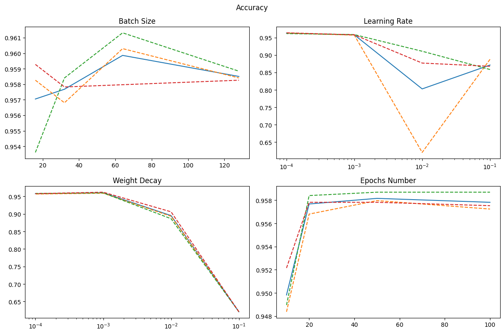
*Figure 6: Results of hyperparameter tuning for the VGG-like model.*

#### Observations
The model struggled with the `unknown` class, frequently misclassifying it as one of the target commands. This issue was exacerbated by dataset imbalance, as shown in the confusion matrix.

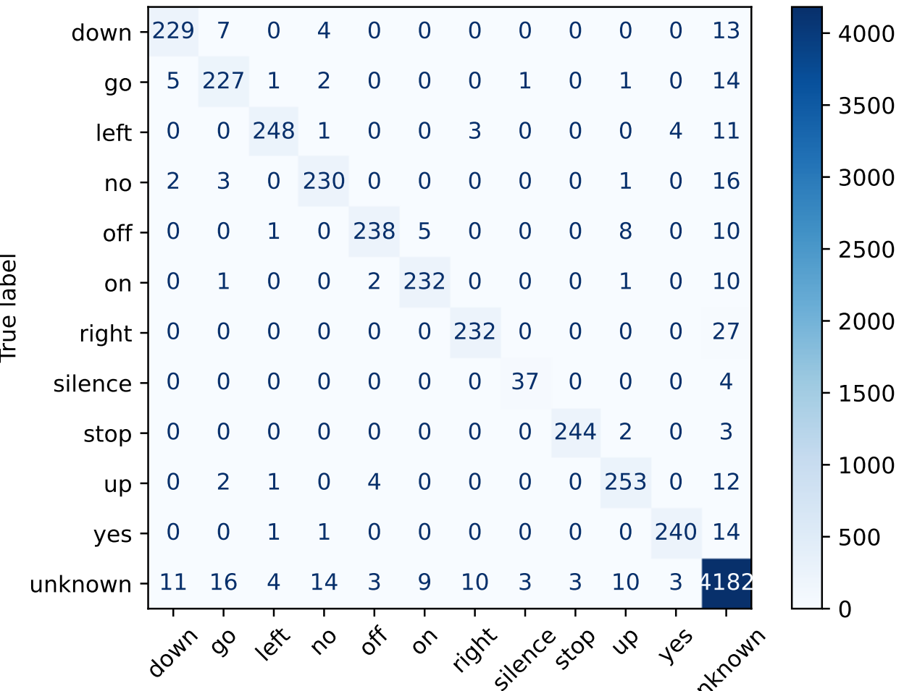
*Figure 8: Confusion matrix for the VGG-like model.*

---

### ResNet-like Model Results

#### Methodology
The ResNet-like 1D CNN architecture was evaluated using the same experimental setup as the VGG-like model. Residual connections were leveraged to facilitate the training of deeper networks, enabling the model to learn identity mappings effectively.

#### Results
- **Batch Size**: Larger batch sizes (128) improved stability, achieving the highest accuracy of 96.29%.
- **Learning Rate**: A learning rate of 0.0001 provided the best performance (97.09%), confirming the benefits of low learning rates for deep networks.
- **Weight Decay**: Minimal regularization (0.0001) yielded the best results (95.92%), avoiding overfitting.
- **Epochs**: Training for 50 epochs was sufficient to achieve optimal accuracy.

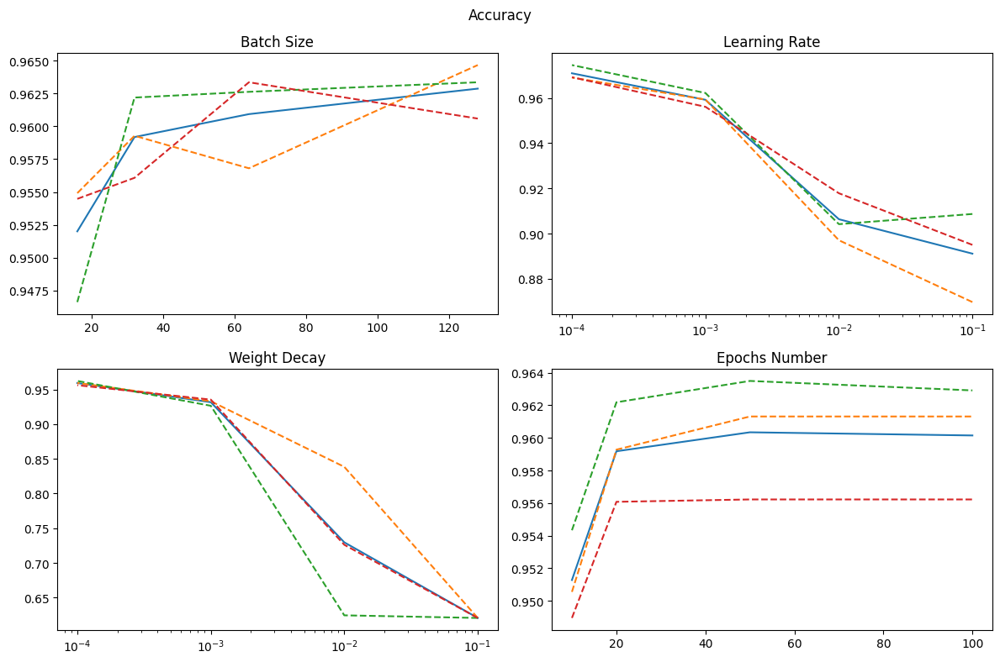
*Figure 9: Results of hyperparameter tuning for the ResNet-like model.*

#### Observations
The ResNet-like model outperformed the VGG-like model, achieving higher accuracy and better generalization. However, challenges with the `unknown` class persisted.

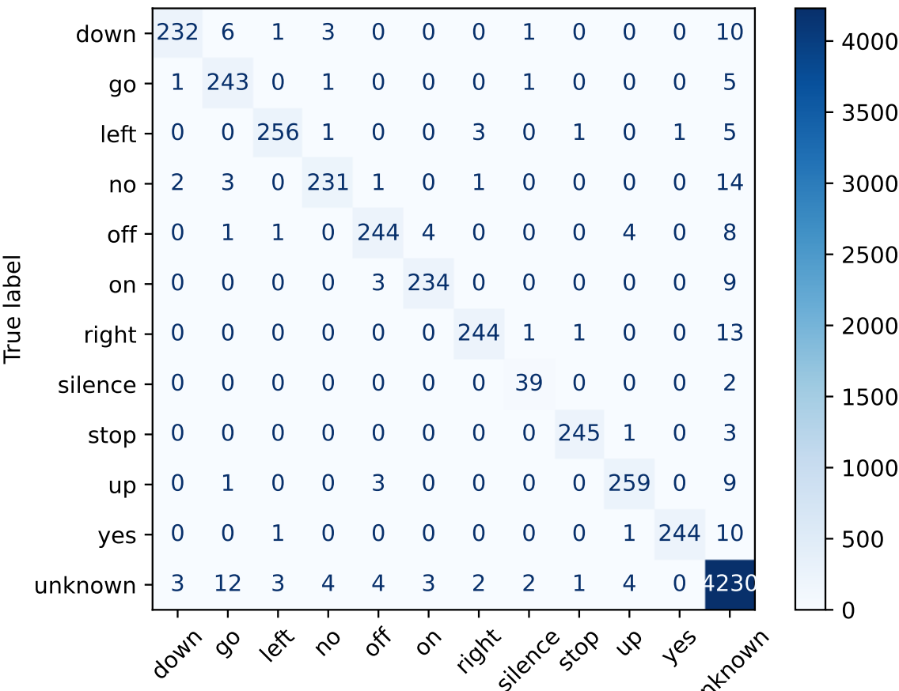
*Figure 10: Confusion matrix for the ResNet-like model.*

---

### VGG-like VSU Model Results

#### Methodology
A specialized VGG-like model was trained to classify inputs into three meta-categories: `valid`, `silence`, and `unknown`. This approach aimed to address the challenges associated with the `unknown` class. Hyperparameter tuning was conducted similarly to the previous experiments.

#### Results
- **Batch Size**: The best accuracy (96.42%) was achieved with a batch size of 64.
- **Learning Rate**: A learning rate of 0.0001 provided the highest accuracy (96.69%).
- **Weight Decay**: Minimal regularization (0.0001) yielded the best results.
- **Epochs**: Training for 50 epochs was optimal.

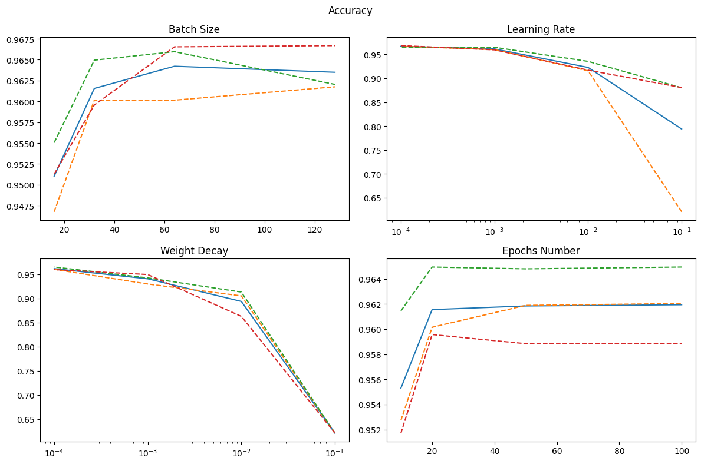
*Figure 11: Results of hyperparameter tuning for the VGG-like VSU model.*

#### Observations
While the VGG-like VSU model improved the classification of `unknown` samples, significant misclassifications remained. An ensemble approach combining this model with other classifiers did not yield substantial performance gains.

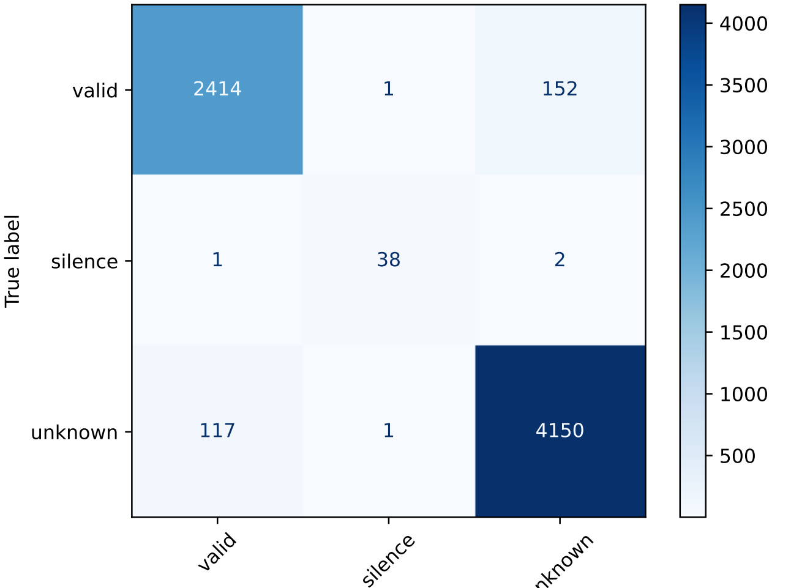
*Figure 12: Confusion matrix for the VGG-like VSU model.*

---

### Audio Spectrogram Transformer (AST) Results

#### Methodology
The AST model was trained on spectrogram inputs, leveraging self-attention mechanisms to capture long-range dependencies. Experiments focused on varying batch size, learning rate, and weight decay.

#### Results
- **Batch Size**: Smaller batch sizes improved performance, with the best accuracy (90.52%) achieved at batch size 1.
- **Learning Rate**: Increasing the learning rate to 0.0001 improved accuracy, overcoming local minima.
- **Weight Decay**: Weight decay had minimal impact within the tested range.

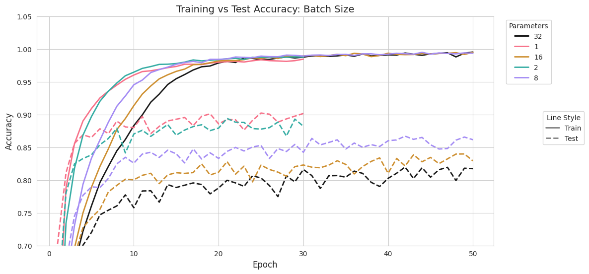
*Figure 13: Influence of batch size on AST accuracy.*

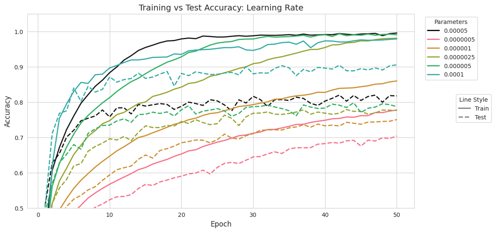
*Figure 14: Influence of learning rate on AST accuracy.*

#### Observations
The AST model struggled with out-of-distribution inputs, particularly the `unknown` class. The confusion matrix highlighted frequent misclassifications.

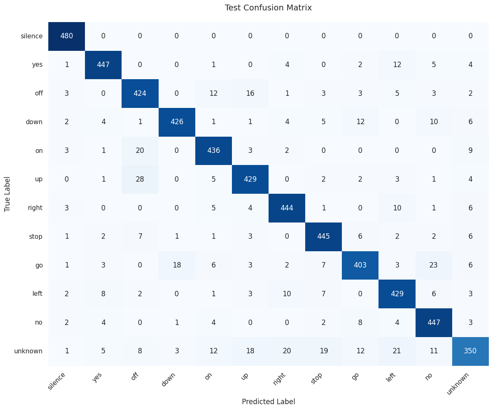
*Figure 16: Confusion matrix for the AST model.*

---

### AST with Sigmoid Head Results

#### Methodology
The AST architecture was modified to use sigmoid activations instead of softmax, allowing independent probability estimates for each class. Binary cross-entropy loss was used for training.

#### Results
- **Batch Size**: The best accuracy (81.45%) was achieved with a batch size of 1.
- **Learning Rate**: Higher learning rates improved performance, with the best results at 0.0001.
- **Weight Decay**: Minimal impact was observed within the tested range.

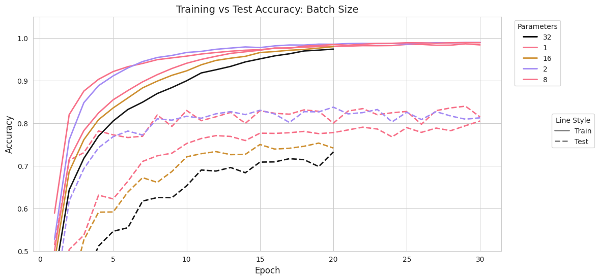
*Figure 17: Influence of batch size on AST with sigmoid head accuracy.*

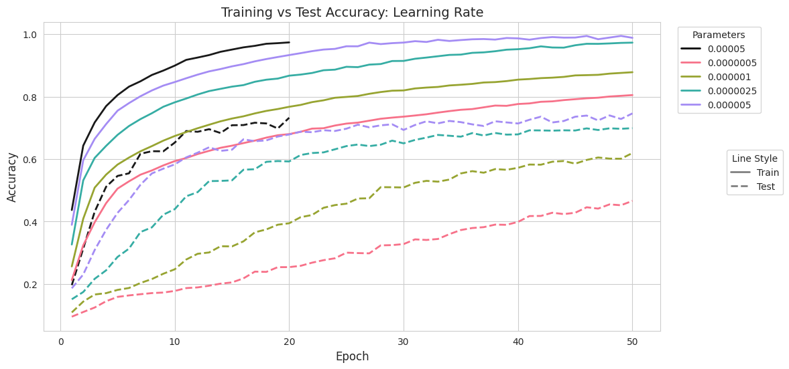
*Figure 18: Influence of learning rate on AST with sigmoid head accuracy.*

#### Observations
The sigmoid-based AST model struggled to handle out-of-distribution inputs effectively, frequently misclassifying `unknown` samples.

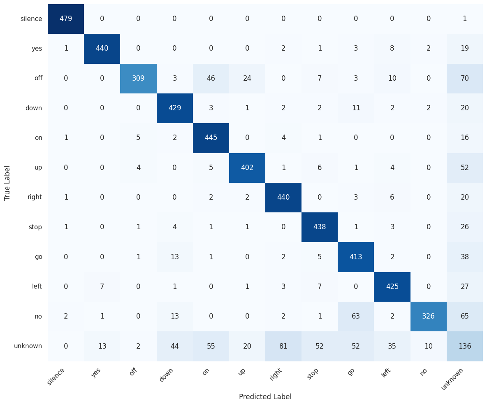
*Figure 20: Confusion matrix for AST with sigmoid head.*

---

## Conclusions

The experiments revealed that 1D CNN architectures, particularly the ResNet-like model, outperformed transformer-based approaches for speech command classification. However, challenges with the `unknown` class persisted across all models. Future work should explore hybrid architectures and improved data augmentation techniques to address these limitations.
